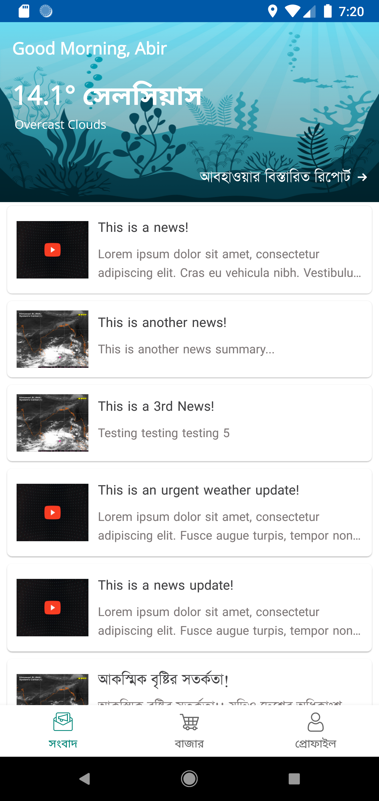
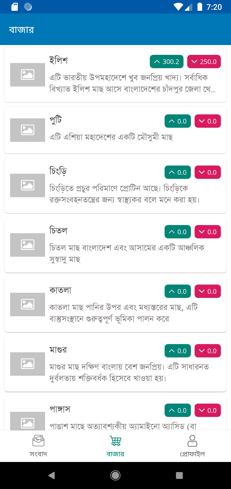
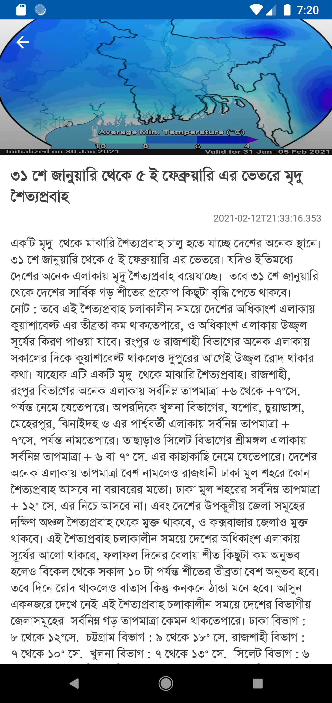

<!------>
 

  

<h3 align="center">FisherVille</h3>

  

    A ledger book with smart features
     
     
    <a href="https://github.com/Partha11/fisherville/releases/tag/alpha">View Demo</a>
    ·
    <a href="https://github.com/Partha11/fisherville/issues">Report Bug</a>
    ·
    <a href="https://github.com/Partha11/fisherville/issues">Request Feature</a>
  

## Structure
- Model (for database, API and preferences)
- View (for UI logic, with DataBinding)
- ViewModel (for business logic)
- Workers (for background processing)
- Broadcast Service (for triggering specific services depending on user events)

(<a href="#readme-top">back to top</a>)

### Built With

This application is developed using Kotlin. It uses a Laravel/Lumen backend for user information, which is accessed via REST APIs'. Firebase Authentication is used in this project for implementing some of the Firebase features, such as Realtime Database and Cloud Messaging.

* [![Kotlin][kotlin]][kotlin-url]
* [![Firebase][firebase]][firebase-url]
* [![Google Cloud][google-cloud]][google-cloud-url]

(<a href="#readme-top">back to top</a>)

## Dependencies
- Dependency injection (with [Hilt](http://google.github.io/hilt/))
- Google [Material Design](https://material.io/blog/android-material-theme-color) library
- Android architecture components to share ViewModels during configuration changes
- [Jetpack Navigation](https://developer.android.com/guide/navigation) for single activity design
- Kotlin Coroutines
- Retrofit
- [Desugaring](https://developer.android.com/studio/write/java8-support-table) for Java 8 API support

(<a href="#readme-top">back to top</a>)

### Screenshots

    
    
    

(<a href="#readme-top">back to top</a>)

## Features
- Fully based on firebase and google cloud services
- Offline capabilities with persistent database
- No registration required
- Personal ledger with real time data update
- Real time market price using location
- Feature for buying/selling directly from application
- Real time weather report using [OpenWeather](https://openweathermap.org/) API
- Intelligent calculation of gross profit/loss

(<a href="#readme-top">back to top</a>)

## To Do List

- [ ] Add real time chat feature
- [ ] Add pagination from firebase realtime database
- [x] Add databinding
    - [x] Update project structure to use single activity
- [x] Upgrade dependencies
- [x] Update project structure
- [ ] Code cleanup
- [x] Update splash animation
- [ ] Add multi-language support
    - [x] Bangla
    - [ ] English
- [x] Eliminate uses of string literal
- [x] Add feature for push notification
- [ ] Improve p2p connection time
- [ ] Upgrade Speech to Text library

(<a href="#readme-top">back to top</a>)

<!-- MARKDOWN LINKS & IMAGES -->
[kotlin]: https://img.shields.io/badge/kotlin-7F52FF?style=for-the-badge&logo=kotlin&logoColor=white
[kotlin-url]: https://kotlinlang.org/
[java]: https://img.shields.io/badge/java-F78C40?style=for-the-badge&logo=openjdk&logoColor=white
[java-url]: https://www.java.com/en/
[google-cloud]: https://img.shields.io/badge/google%20cloud-4285F4?style=for-the-badge&logo=google%20cloud&logoColor=white
[google-cloud-url]: https://cloud.google.com
[firebase]: https://img.shields.io/badge/firebase-FFCA28?style=for-the-badge&logo=firebase&logoColor=white
[firebase-url]: https://firebase.google.com/
[mysql]: https://img.shields.io/badge/mysql-4479A1?style=for-the-badge&logo=mysql&logoColor=white
[mysql-url]: https://img.shields.io/badge/mysql-4479A1?style=for-the-badge&logo=mysql&logoColor=white
[lumen]: https://img.shields.io/badge/lumen-E74430?style=for-the-badge&logo=lumen&logoColor=white
[lumen-url]: https://lumen.laravel.com